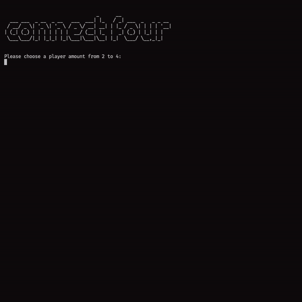

# connect-four

A compact implementation of connect four written in rust.



## Run the game

At the moment there no pre-built binaries - but you can build it locally with `cargo`.

```bash
# run the game
cargo run

# build a binary & execute it
cargo build --release
./target/release/connect-four
```

